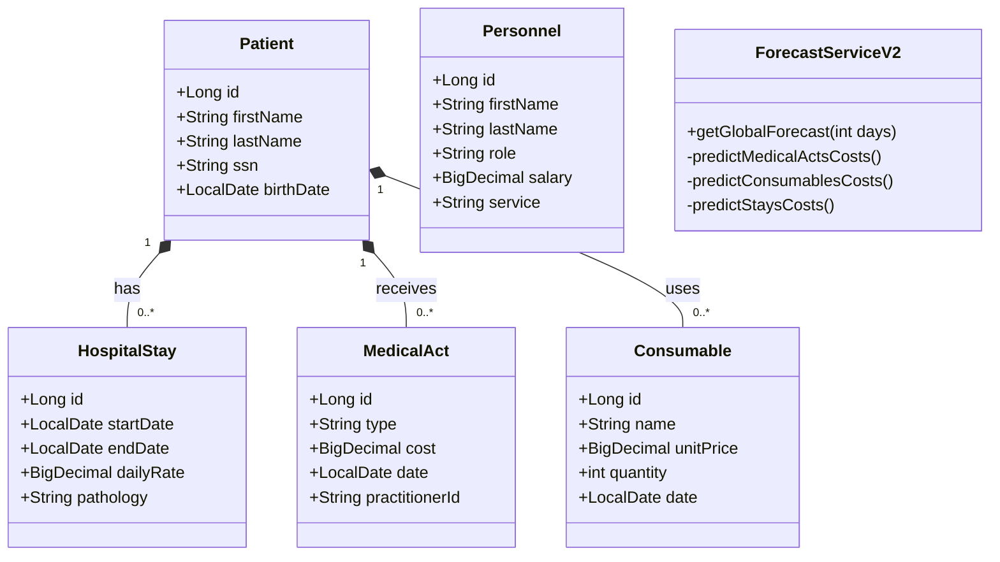
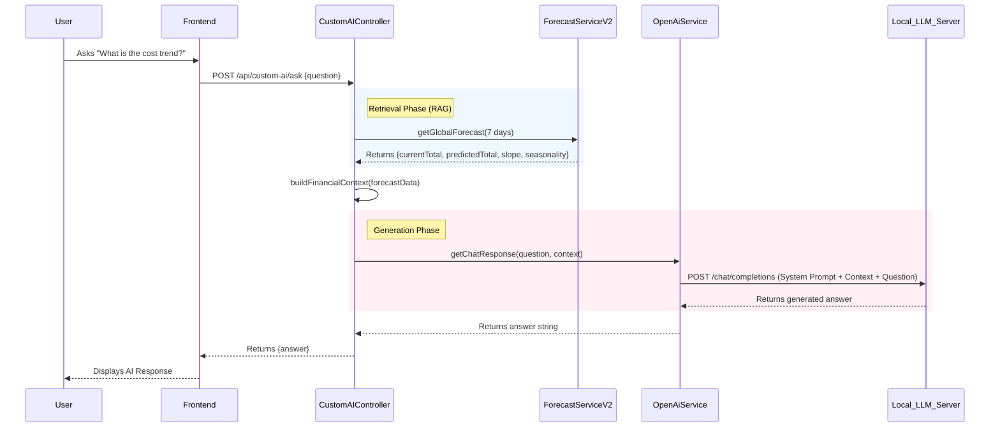
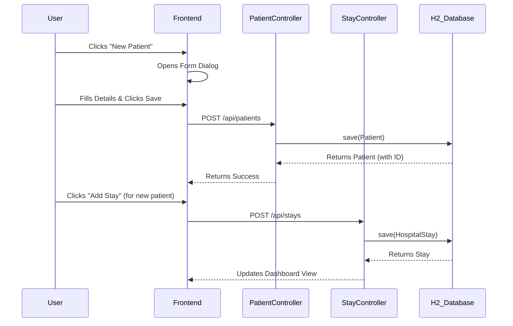

# HospiFin Architecture Diagrams

This document contains the UML diagrams for the HospiFin project, illustrating the system's actors, structure, and key workflows.

## 1. Use Case Diagram
This diagram illustrates the interactions between users (Medical Staff, Administrators) and the system features.

```mermaid
usecaseDiagram
    actor "User" as User

    package "HospiFin System" {
        usecase "View Financial Dashboard" as UC1
        usecase "Manage Patients" as UC2
        usecase "Manage Medical Acts" as UC3
        usecase "Manage Inventory (Consumables/Meds)" as UC4
        usecase "Ask AI Financial Assistant" as UC5
        usecase "View Forecasts" as UC6
        usecase "Manage Personnel" as UC7
        usecase "Configure Settings" as UC8
    }

    User --> UC1
    User --> UC2
    User --> UC3
    User --> UC4
    User --> UC5
    User --> UC6
    User --> UC7
    User --> UC8

    UC1 ..> UC6 : includes
    UC5 ..> UC6 : uses data from
```

---

## 2. Class Diagram
This diagram details the database schema and object relationships based on the JPA entities.



---

## 3. Sequence Diagrams

### 3.1 AI RAG Workflow (Ask Financial Question)
This sequence shows how the system retrieves real financial data (RAG) to ground the AI's response.



### 3.2 Patient Admission Flow
The standard workflow for adding a patient and their initial stay.


