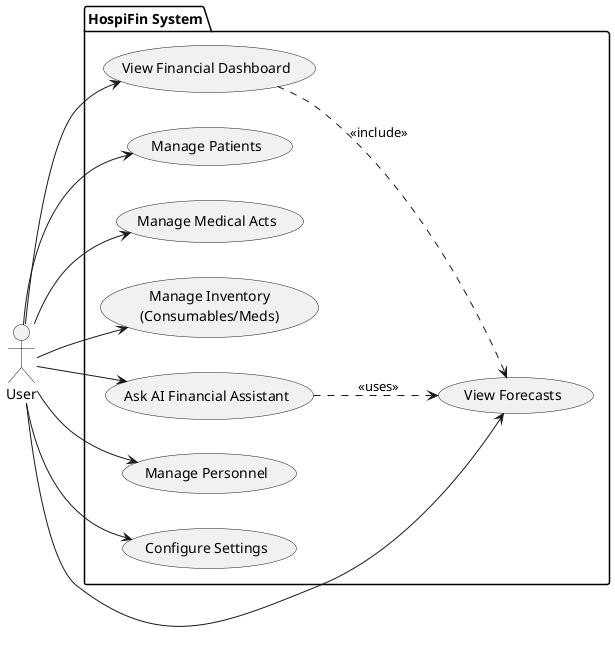
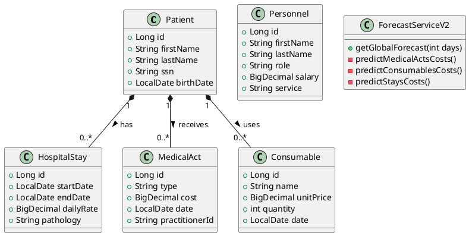
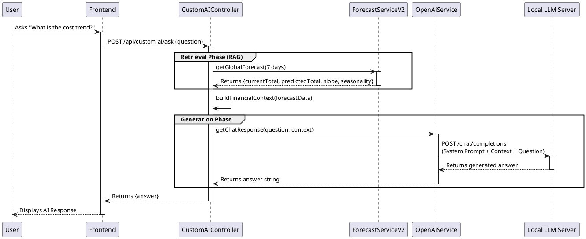
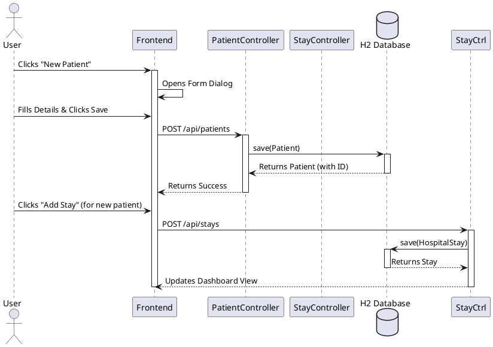

# HospiFin PlantUML Diagrams

This document contains the PlantUML code for the HospiFin project diagrams. You can render these using any PlantUML editor or the official [PlantUML Server](http://www.plantuml.com/plantuml/).

## 1. Use Case Diagram

---

## 2. Class Diagram

---

## 3. Sequence Diagrams

### 3.1 AI RAG Workflow (Ask Financial Question)

### 3.2 Patient Admission Flow

